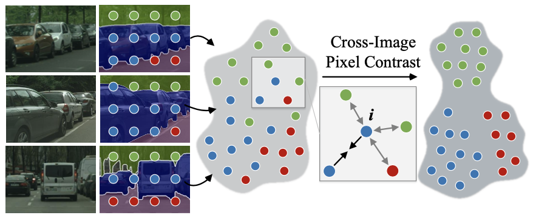

# ContrastiveSeg
This repository contains the PyTorch implementation for Our Paper "Exploring Cross-Image Pixel Contrast for Semantic Segmentation" by [Wenguan Wang](https://sites.google.com/view/wenguanwang/), [Tianfei Zhou](https://www.tfzhou.com/), [Fisher Yu](https://www.yf.io/), [Jifeng Dai](https://jifengdai.org/), [Ender Konukoglu](https://scholar.google.com/citations?user=OeEMrhQAAAAJ&hl=en) and [Luc Van Gool](https://scholar.google.com/citations?user=TwMib_QAAAAJ&hl=en). 

