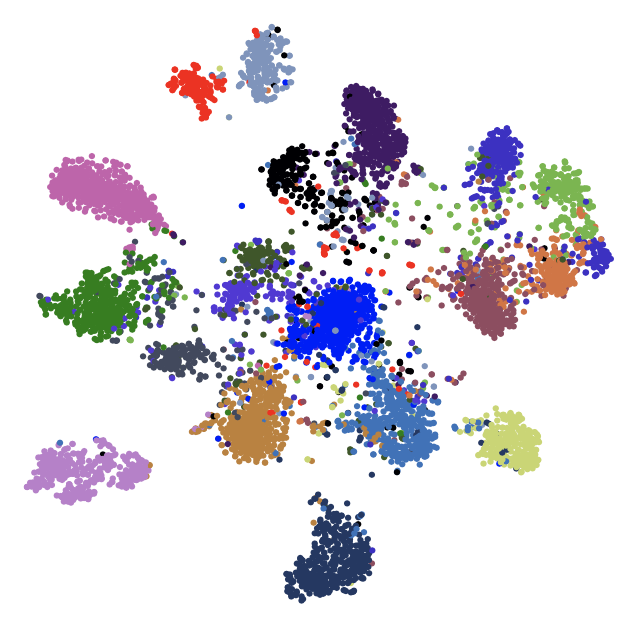
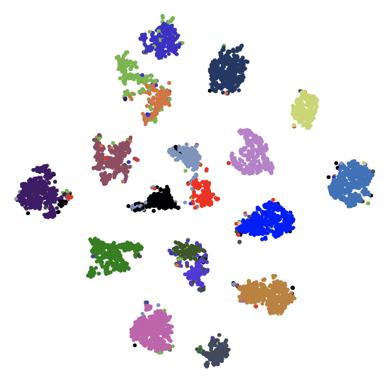

# Exploring Cross-Image Pixel Contrast for Semantic Segmentation


> [**Exploring Cross-Image Pixel Contrast for Semantic Segmentation**](https://arxiv.org/abs/2101.11939),            
> [Wenguan Wang](https://sites.google.com/view/wenguanwang/), [Tianfei Zhou](https://www.tfzhou.com/), [Fisher Yu](https://www.yf.io/), [Jifeng Dai](https://jifengdai.org/), [Ender Konukoglu](https://scholar.google.com/citations?user=OeEMrhQAAAAJ&hl=en) and [Luc Van Gool](https://scholar.google.com/citations?user=TwMib_QAAAAJ&hl=en) <br>
> *ICCV 2021 (Oral) ([arXiv 2101.11939](https://arxiv.org/abs/2101.11939))*

## News

* [2022-10-13] Our work [GMMSeg: Gaussian Mixture based Generative Semantic Segmentation Models](https://github.com/leonnnop/GMMSeg) has been accepted to NeurIPS'22.
* [2022-03-20] Our work [Rethinking Semantic Segmentation: A Prototype View](https://github.com/tfzhou/ProtoSeg) has been accepted to CVPR'22 as an **Oral paper**. 
* [2021-07-28] ContrastiveSeg has been accepted in ICCV'21 as Oral.
* [2021-07-28] Update memory code.
* [2021-07-01] The codebase has been transferred from Pytorch-0.4.1 to Pytorch-1.7.1, which will be easier for usage.

## Abstract

Current semantic segmentation methods focus only on
mining “local” context, i.e., dependencies between pixels
within individual images, by context-aggregation modules
(e.g., dilated convolution, neural attention) or structureaware optimization criteria (e.g., IoU-like loss). However, they ignore “global” context of the training data, i.e.,
rich semantic relations between pixels across different images. Inspired by the recent advance in unsupervised contrastive representation learning, we propose a pixel-wise
contrastive framework for semantic segmentation in the
fully supervised setting. The core idea is to enforce pixel
embeddings belonging to a same semantic class to be more
similar than embeddings from different classes. It raises a
pixel-wise metric learning paradigm for semantic segmentation, by explicitly exploring the structures of labeled pixels, which are long ignored in the field. Our method can be
effortlessly incorporated into existing segmentation frameworks without extra overhead during testing.

We experimentally show that, with famous segmentation models (i.e.,
DeepLabV3, HRNet, OCR) and backbones (i.e., ResNet, HRNet), our method brings consistent performance improvements across diverse datasets (i.e., Cityscapes, PASCALContext, COCO-Stuff).

## Installation

This implementation is built on [openseg.pytorch](https://github.com/openseg-group/openseg.pytorch). Many thanks to the authors for the efforts.

Please follow the [Getting Started](https://github.com/openseg-group/openseg.pytorch/blob/master/GETTING_STARTED.md) for installation and dataset preparation.

## Performance

### Cityscapes Dataset

| Backbone  | Model      | Train Set | Val Set | Iterations | Batch Size | Contrast Loss | Memory | mIoU  | Log | CKPT |Script |
| --------- | ---------- | --------- | ------- | ---------- | ---------- | ------------- | ------ | ----- | --- | ----   | ----   |
| ResNet-101| DeepLab-V3 |train     | val     | 40000      | 8          | N             | N      | 72.75 | [log](https://github.com/tfzhou/pretrained_weights/releases/download/v0.1/deeplab_v3_deepbase_resnet101_dilated8_deeplab_v3.log) | [ckpt](https://github.com/tfzhou/pretrained_weights/releases/download/v0.1/deeplab_v3_deepbase_resnet101_dilated8_deeplab_v3_max_performance.pth) |```scripts/cityscapes/deeplab/run_r_101_d_8_deeplabv3_train.sh```|
| ResNet-101| DeepLab-V3 |train     | val     | 40000      | 8          | Y             | N      | 77.67 | [log](https://github.com/tfzhou/pretrained_weights/releases/download/v0.1/deeplab_v3_contrast_deepbase_resnet101_dilated8_deeplab_v3_contrast.log) | [ckpt](https://github.com/tfzhou/pretrained_weights/releases/download/v0.1/deeplab_v3_contrast_deepbase_resnet101_dilated8_deeplab_v3_contrast_max_performance.pth) |```scripts/cityscapes/deeplab/run_r_101_d_8_deeplabv3_contrast_train.sh```|
| HRNet-W48 | HRNet-W48  |train     | val     | 40000      | 8          | N             | N      | 79.27 | [log](https://github.com/tfzhou/pretrained_weights/releases/download/v0.1/hrnet_w48_lr1x_hrnet_ce.log) | [ckpt](https://github.com/tfzhou/pretrained_weights/releases/download/v0.1/hrnet_w48_lr1x_hrnet_ce_max_performance.pth) |```scripts/cityscapes/hrnet/run_h_48_d_4.sh```|
| HRNet-W48 | HRNet-W48  |train     | val     | 40000      | 8          | Y             | N      | 80.18 | [log](https://github.com/tfzhou/pretrained_weights/releases/download/v0.1/hrnet_w48_contrast_lr1x_hrnet_contrast_t0.1.log) | [ckpt](https://github.com/tfzhou/pretrained_weights/releases/download/v0.1/hrnet_w48_contrast_lr1x_hrnet_contrast_t0.1_max_performance.pth) |```scripts/cityscapes/hrnet/run_h_48_d_4_contrast.sh```|

_It seems that the DeepLab-V3 baseline does not produce the expected performance on the new codebase. I will tune this later._


### Study of the temperature
| Backbone  | Train Set | Val Set | Iterations | Batch Size | Temperature   | mIoU  |
| --------- | --------- | ------- | ---------- | ---------- | ------------- | ----- |
| HRNet-W48 | train     | val     | 40000      | 8          | 0.05          | 79.80 |
| HRNet-W48 | train     | val     | 40000      | 8          | 0.07          | 79.59 |
| HRNet-W48 | train     | val     | 40000      | 8          | 0.10          | **80.18** |
| HRNet-W48 | train     | val     | 40000      | 8          | 0.20          | 80.01 |
| HRNet-W48 | train     | val     | 40000      | 8          | 0.30          | 79.27 |
| HRNet-W48 | train     | val     | 40000      | 8          | 0.40          | 79.40 |


## t-SNE Visualization

* Pixel-wise Cross-Entropy Loss
<p align="center">
  
</p>

* Pixel-wise Contrastive Learning Objective 
  
<p align="center">
  
</p>  

## Citation
```
@inproceedings{Wang_2021_ICCV,
    author    = {Wang, Wenguan and Zhou, Tianfei and Yu, Fisher and Dai, Jifeng and Konukoglu, Ender and Van Gool, Luc},
    title     = {Exploring Cross-Image Pixel Contrast for Semantic Segmentation},
    booktitle = {Proceedings of the IEEE/CVF International Conference on Computer Vision (ICCV)},
    year      = {2021},
    pages     = {7303-7313}
}
```
